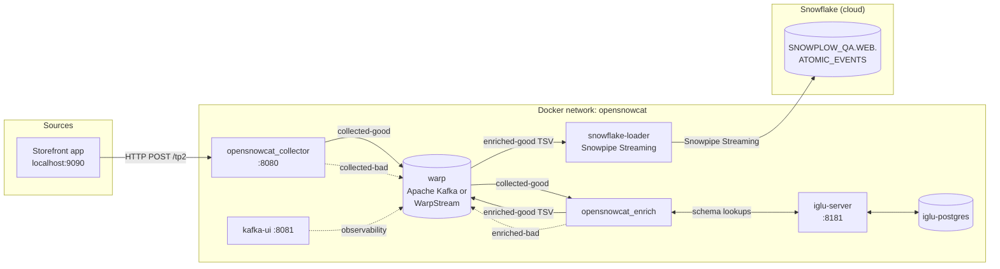
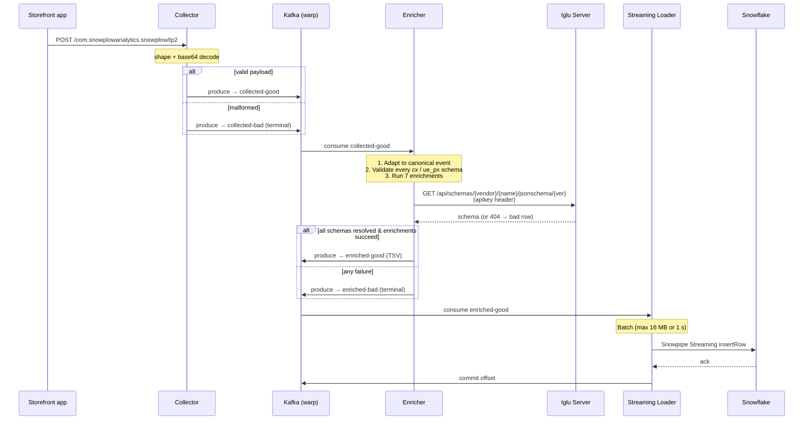

# OpenSnowcat Devkit — Adobe Commerce Pipeline

A local Docker pipeline that mirrors Adobe Commerce's Snowplow BDP setup:
storefront events are collected, validated against custom Iglu schemas,
enriched with seven plugins, and loaded into Snowflake via Snowpipe Streaming.

The collector and enricher are stock OpenSnowcat (the open-source fork of
Snowplow). The pieces around them — schema registry, schema sync from BDP,
Snowflake loader — are configured for the Adobe Commerce use case.

## Architecture



Solid arrows are the happy path. Dashed arrows are bad-row paths — they stay
in Kafka for debugging and never reach Snowflake.

## Event flow



End-to-end latency is ~1–6 s under the default batching config
(`batching.maxDelay = 1 second` in `opensnowcat/snowflake-streaming-loader.hocon`).

## Components

| Service | Image | Port (host) | Purpose |
|---|---|---|---|
| `warp` | `apache/kafka:latest` | — | Single-broker KRaft Kafka. Holds all six topics. |
| `kafka_proxy` | `alpine/socat` | 9092 | TCP relay so host tools can hit `warp:9092`. |
| `opensnowcat_collector` | `opensnowcat/opensnowcat-collector-kafka` | 8080 | Receives storefront events at `/com.snowplowanalytics.snowplow/tp2`. |
| `iglu-postgres` | `postgres:15-alpine` | — | Persistent backing store for the Iglu schema registry. |
| `iglu-setup` | `snowplow/iglu-server:0.12.0` | — | One-shot init container that creates the Iglu DB schema. |
| `iglu-server` | `snowplow/iglu-server:0.12.0` | 8181 | Schema registry. Holds the 85 custom commerce schemas pulled from BDP plus standard Snowplow schemas. |
| `opensnowcat_enrich` | `opensnowcat/opensnowcat-enrich-kafka` | — | Validates + enriches events. Resolver tries the local Iglu Server first, falls back to Iglu Central. Writes enriched events as Snowplow canonical TSV. |
| `snowflake-loader` | `snowplow/snowflake-loader-kafka:0.5.1` | — | Snowplow Snowflake Streaming Loader. Reads `enriched-good` TSV directly, writes to Snowflake via Snowpipe Streaming. |
| `kafka-ui` | `provectuslabs/kafka-ui` | 8081 | Observability — topic browse, consumer lag, message inspection. |

### Kafka topics

| Topic | Producer | Consumer(s) | Loaded to Snowflake? |
|---|---|---|---|
| `collected-good` | Collector | Enricher | indirectly (via enriched-good) |
| `collected-bad` | Collector | — (debug) | No |
| `enriched-good` | Enricher (TSV) | Streaming Loader | **Yes** |
| `enriched-bad` | Enricher | — (debug) | No |
| `snowflake-loader-bad` | Streaming Loader | — (debug) | No |

## Repository layout

```
opensnowcat-devkit/
├── ARCHITECTURE.md                    ← you are here
├── README.md                          ← original upstream OpenSnowcat README
├── snowplow_bdp                       ← project brief (BDP migration goal)
├── Makefile                           ← run-kafka, status, pull-schemas, etc.
├── docker-compose.yml                 ← Base stack (default broker = Apache Kafka)
├── docker-compose.warpstream.yml      ← Override: swaps broker to WarpStream
├── .env.example                       ← copy to .env, fill in credentials
│
├── opensnowcat/                       ← Snowplow component configs
│   ├── config.collector.hocon
│   ├── config.enrich.hocon
│   ├── resolver.json                  ← Iglu repo priorities
│   ├── iglu-server.hocon
│   ├── snowflake-streaming-loader.hocon
│   └── enrichments/                   ← the 7 enabled enrichments
│
├── schemas/                           ← Iglu schemas pulled from BDP
│   └── com.adobe.magento.{entity,event}/
│
├── snowflake/
│   ├── atomic_events.sql              ← target table DDL (189 columns)
│   ├── grants.sql                     ← role/user/grant setup
│   ├── snowflake-key.p8 / .pub        ← key-pair auth (gitignored)
│   └── README.md
│
└── scripts/
    ├── pull-schemas.sh                ← sync schemas from BDP Data Structures API
    ├── send-bad-events.sh             ← exercise the bad-event flow
    └── generate-snowflake-keypair.sh
```

## Choosing a broker: Kafka vs WarpStream

The pipeline runs against either Apache Kafka (default) or WarpStream
(production-like, S3-backed) — picked at startup time. Everything else
in the stack is identical.

| Mode | Make target | What runs as `warp` |
|---|---|---|
| Kafka (default) | `make run-kafka` | `apache/kafka:latest` |
| WarpStream | `make run-warpstream` | `warpstream_agent` playground |

This works via Docker Compose's override pattern:
- `docker-compose.yml` defines the full stack with Kafka as the broker
- `docker-compose.warpstream.yml` overrides **only** the `warp` service to
  use WarpStream's playground agent (`!override` on `environment` strips
  the Kafka `KAFKA_*` vars). Every other service is inherited unchanged.

The `make run-warpstream` target invokes:

```bash
docker compose -f docker-compose.yml -f docker-compose.warpstream.yml up -d
```

### Switching brokers

`make stop` between switches — both stacks use the same container names
and ports, so they can't run simultaneously.

- **Iglu schemas persist** across switches (the `iglu-pgdata` volume
  survives `docker compose down`).
- **Kafka topics and consumer offsets do not persist** — they live inside
  the broker container, which is replaced when you switch. Re-fire events
  from your storefront app after switching.
- **WarpStream playground** has an upstream 4-hour timeout; the container
  needs to be restarted after that for long sessions.

## Quick start

Prerequisites: Docker Desktop, an `.env` (copy `.env.example`), Snowflake
table created (`snowflake/atomic_events.sql` + `snowflake/grants.sql`), and
the loader's key-pair registered on the loader user (`make snowflake-keypair`
prints the SQL).

```bash
# 1. Bring up the stack (pick one)
make run-kafka         # Apache Kafka
# or
make run-warpstream    # WarpStream (needs `127.0.0.1 warp` in /etc/hosts)

# 2. First time only: pull custom schemas from BDP and upload to local Iglu
make pull-schemas
make upload-schemas

# 3. Fire events at the collector
#    Storefront app POST → http://localhost:8080/com.snowplowanalytics.snowplow/tp2

# 4. Observe
make status                # offsets + consumer lag in the terminal
make kafka-ui              # http://localhost:8081
make warpstream-console    # (WarpStream only) opens WarpStream Console URL

# 5. Verify in Snowflake
#    SELECT COUNT(*) FROM SNOWPLOW_QA.WEB.ATOMIC_EVENTS;
```

## Sub-area docs

For deeper dives in each subsystem:

- `opensnowcat/README.md` — collector, enricher, enrichments, resolver
- `schemas/README.md` — Iglu schema format and the BDP sync workflow
- `snowflake/README.md` — table DDL, grants, key-pair auth, loader config
- `scripts/README.md` — automation scripts

## Bad-row debugging

When events fail validation or enrichment, the failure record is written to
either `collected-bad` or `enriched-bad`. Each bad row is a Snowplow badrow
JSON document (`schema_violations`, `enrichment_failures`, etc.) containing
both the failure reason and the original payload. Browse them in Kafka UI
(`make kafka-ui` → topic → messages).
